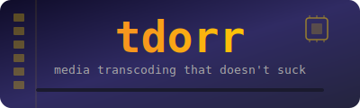

<p align="center">
  
</p>

<p align="center">
  <strong>GPU-accelerated media transcoding that I could figure out.</strong>
</p>

<p align="center">
  <a href="#features">Features</a> &bull;
  <a href="#install">Install</a> &bull;
  <a href="#usage">Usage</a> &bull;
  <a href="#config">Config</a> &bull;
  <a href="#license">License</a>
</p>

---

## Why?

I spent an entire evening trying to get [Tdarr](https://github.com/HaveAGitGat/Tdarr) working. Nodes, servers, web UIs, plugins, databases... I just wanted to convert my media library to h265. So I wrote tdorr instead.

**tdorr** is a single binary. Point it at a directory. It finds video files, skips the ones that are already fine, and GPU-transcodes the rest to h265. That's it.

## Features

- **GPU-accelerated h265 encoding** &mdash; NVIDIA NVENC and Intel VAAPI
- **Smart detection** &mdash; skips files already in h265 at or below your target resolution/bitrate
- **Safe by default** &mdash; creates `.transcoded.mkv` copies; never touches originals unless you pass `--overwrite`
- **Disc image support** &mdash; extracts and transcodes media from `.iso` and `.img` files via [isomage](https://github.com/JackDanger/isomage)
- **YAML config** &mdash; sensible defaults, fully overridable
- **Fast** &mdash; 14x realtime on an RTX 2060 for 720p content

## Install

Requires Rust and `ffmpeg` with GPU encoder support (`hevc_nvenc` or `hevc_vaapi`).

```bash
git clone https://github.com/JackDanger/tdorr.git
cd tdorr
make build
# ./tdorr is now symlinked to the release binary
```

For `.iso`/`.img` support, also install [isomage](https://github.com/JackDanger/isomage).

## Usage

```bash
# Dry run - see what would be transcoded
./tdorr --dry-run --config config.yaml /mnt/media/movies

# Transcode (creates copies alongside originals)
./tdorr --config config.yaml /mnt/media/movies

# Transcode to a separate output directory
./tdorr --config config.yaml --output-dir /mnt/transcoded /mnt/media/movies

# Overwrite originals in-place
./tdorr --overwrite --config config.yaml /mnt/media/movies
```

### What happens

```
$ ./tdorr --config config.yaml /mnt/media/movies
GPU detected: NVIDIA GeForce RTX 2060 (encoder: hevc_nvenc)
Found 8 media files in "/mnt/media/movies"
Transcoding: "Some Dumb Marvel Nonsense/TropeGuy versus GI-Robocop.mkv" (h264, 1280x720, 825 kbps)
  -> "/mnt/media/movies/Some Dumb Marvel Nonsense/TropeGuy versus GI-Robocop.mkv"
...

Done: 8 transcoded, 0 skipped, 0 errors (of 8 total)
```

Run it again and everything gets skipped:

```
Found 8 media files in "/mnt/media/dumb-tv"

Done: 0 transcoded, 8 skipped, 0 errors (of 8 total)
```

## Config

Ships with a default-okay `config.yaml`, which you can edit:

```yaml
target:
  codec: hevc
  quality: 28          # CQ value (lower = better quality, bigger file)
  preset: slow         # NVENC: p7, VAAPI: mapped automatically
  max_width: 3840      # 4K max
  max_height: 2160
  max_bitrate_kbps: 0  # 0 = no limit (CQ decides)
  container: mkv
  audio_codec: copy    # Don't re-encode audio
  subtitle_codec: copy

media_extensions:
  - mkv
  - mp4
  - avi
  - ts
  - m2ts
  - iso
  - img
```

## GPU Requirements

tdorr requires a GPU for encoding and will exit with a clear error if none is found:

| GPU | Encoder | How it's detected |
|-----|---------|-------------------|
| NVIDIA (Kepler+) | `hevc_nvenc` | `nvidia-smi` + ffmpeg encoder check |
| Intel (Broadwell+) | `hevc_vaapi` | `/dev/dri/renderD128` + ffmpeg encoder check |

No GPU? No encoding. This is intentional &mdash; CPU h265 encoding is painfully slow and not what tdorr is for.

## License

[MIT](LICENSE) &copy; Jack Danger
